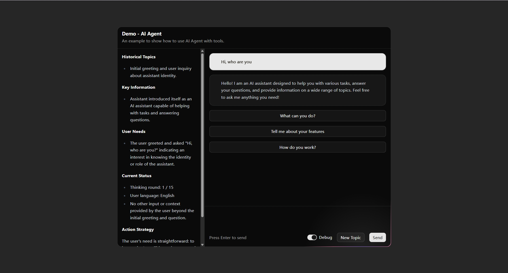
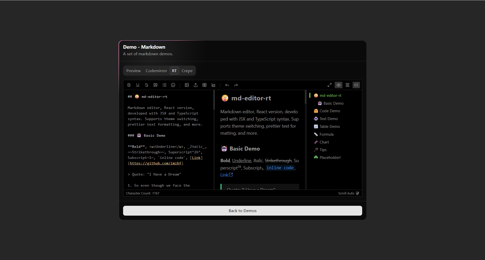
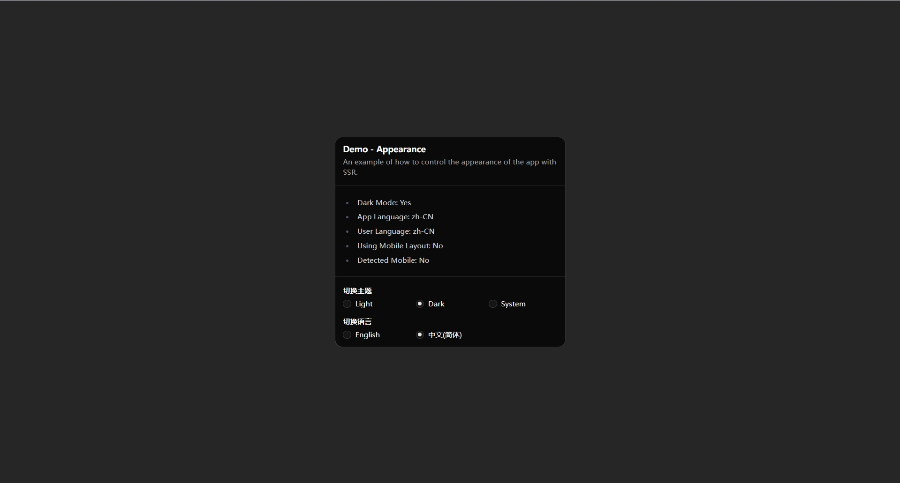

# Nextop

Nextop is a boilerplate built on [Next.js](https://nextjs.org), designed to streamline the development of modern web applications by providing a robust set of features and integrations out of the box.

## Features

- AI Agent
- Bun
- Docker
- File upload
- Global progress bar
- I18n
- Multiple markdown editors
- Multiple themes
- Next.js v15
- Nuqs
- Prisma
- Session management
- Shadcn UI
- Tailwind CSS v4

## Screenshots





## Development

```bash
bun ci && bun dev
```

## Environment Variables

```bash
cp .env.example .env
```

See more in [Next.js Environment Variables](https://nextjs.org/docs/pages/guides/environment-variables#environment-variable-load-order).

## Before Publishing

- No unauthenticated uploading (`/api/upload`).
- No unauthenticated API calls.
- Do not commit any secrets in the source code.
- Do not expose any sensitive information in the client-side code.

## Deployment

### Docker Compose (Recommended)

```yaml
services:
  app:
    build:
      context: PROJECT_PATH
    restart: unless-stopped
    volumes:
      - ./volumes/runtime:/app/runtime
    environment:
      - PORT=3000
      - ENABLE_DEMO=false
```

### Local

```bash
bun ci && bun run build:default && bun start
```

Learn more env config in [.env.example](.env.example).
